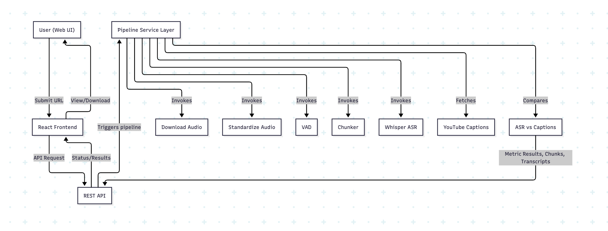

# The YouTube Miner

## 1. Project Overview

**The YouTube Miner** is a full-stack, open-source platform to extract, segment, transcribe, and compare human speech from YouTube videos. It automates download, VAD, chunking, ASR (Whisper), and caption benchmarking with both a CLI and a web UI. Extensively tested, modular, and research/demo ready.

**Purpose:** Offline benchmarking and fair comparison of YouTube speech captions versus open-source ASR.

**Problem Statement:** YouTube captions are often inaccurate. This pipeline provides automated, local, auditable benchmarking with robust test coverage.

**Target users:** Hackathon teams, ML researchers, developers, open-source contributors, accessibility analysts.

**High-level workflow:**
- User submits a YouTube URL via CLI or web UI
- Pipeline downloads audio/captions, segments, chunks, transcribes, benchmarks
- Results and detailed metrics are written to `/output` and viewable via web UI

---

## 2. Architecture Overview

- **Backend (Python, FastAPI):** Pipeline orchestration, API endpoints, run/output management.
- **Frontend (React/TypeScript):** Submit jobs, check status, view/download results.
- **Service modules:** Modular downloader, VAD, chunker, transcriber, comparator – all mock/test-capable.
- **Testing:** Full suite using Pytest, coverage, RTL/Jest for frontend.

**System Flow:**



- **User** → **Frontend** → **API** → **Pipeline services** → **Output/Results**
- CLI flow: Directly invokes modules via `src.main`

**Major Components:**
- **Frontend:** UI, API service layer, history/results pages/components
- **API:** FastAPI app, endpoints for /run, /status, /result, post-processing; input validation, run management
- **Backend modules:** downloader (yt-dlp/ffmpeg), vad (Silero), chunker, transcriber (Whisper via faster-whisper), comparator (semantic/surface score)
- **Testing:** `backend/tests/` (pytest), `frontend/src/pages/*.test.tsx` (Jest/RTL)

---

## 3. Technology Stack

- **Languages:** Python 3.9+, TypeScript/JavaScript
- **Backend:** FastAPI, PyTorch, yt-dlp, faster-whisper, webvtt-py, sentence-transformers, scikit-learn, pytest
- **System Tools:** ffmpeg (required for audio processing)
- **Frontend:** React, Material-UI, React Router, Jest, React Testing Library
- **Coverage/Testing:** pytest-cov, Jest, lcov
- **External Services:** None — strictly offline/local processing
- **ML/AI Models:**
  - **VAD:** Silero VAD
  - **ASR:** Whisper-Tiny (faster-whisper; CPU+GPU)
  - **Semantic Compare:** Sentence Transformers (paraphrase-multilingual-mpnet-base-v2)

---

## 4. Project Structure

```
/ (root)
├── backend/
│   ├── api/           # FastAPI endpoints
│   ├── models/        # Schemas
│   ├── services/      # Core modules (downloader, storage, etc.)
│   ├── runs/          # Run state storage (JSON files)
│   ├── main.py, config.py, requirements.txt
│   ├── tests/         # Backend/unit/integration tests and test artifacts
│   │   └── fake_ch/   # Test chunk folder
├── src/               # Main backend (chunker.py, downloader.py, vad.py, ...)
├── frontend/
│   ├── src/pages, components, services, theme.ts
│   ├── coverage/      # Jest/RTL frontend coverage HTML
├── output/            # Pipeline output (audio, transcripts, diffs, etc)
├── .cursor/debug.log  # Pipeline debug log file
├── architecture.png, image/FlowChart.png  # System flow diagrams
├── README.md, TECHNICAL_DESIGN.md
```

---

## 5. Execution Flow

1. **Input:** YouTube URL from UI or CLI
2. **Download:** yt-dlp, ffmpeg (audio+captions as available)
3. **VAD:** Silero VAD picks speech-only regions
4. **Chunking:** Concatenate regions, write ~30s WAV chunks
5. **Transcription:** Whisper tiny/faster-whisper on selected chunk
6. **Caption Alignment:** Download, parse, align captions (if available)
7. **Comparison:** Compute similarity (semantic + surface), metrics, diff
8. **Output:** Write artifacts to `/output`; visualize via UI/download

---

## 6. Setup Instructions

### Prerequisites
- Python 3.9+, pip, ffmpeg
- Node.js (18+), npm

### Backend Installation
```bash
pip install -r requirements.txt
# or manual:
pip install yt-dlp faster-whisper torch librosa numpy soundfile webvtt-py sentence-transformers scikit-learn fastapi uvicorn
```
Ensure ffmpeg is available in PATH.

### Frontend Installation
```bash
cd frontend
npm install
```
---

## 7. Running the Application

### CLI Pipeline
```bash
python -m src.main "https://www.youtube.com/watch?v=..." [--output-dir DIR] [--chunk-duration 30] [--select-chunk 0]
```
- Outputs will appear in `/output/`

### Backend API (Web)
```bash
uvicorn backend.main:app --reload
```
API served at http://localhost:8000

### Frontend (Web UI)
```bash
cd frontend
npm start
```
UI served at http://localhost:3000

---

## 8. Testing

Run tests to verify the installation and functionality:

**Backend Tests:**
```bash
pytest backend/tests/
```

**Frontend Tests:**
```bash
cd frontend
npm test
```

For detailed testing instructions, coverage reports, and troubleshooting, see `TECHNICAL_DESIGN.md`.

---

## 9. Configuration
- `backend/config.py`: Default pipeline and output settings
- CLI options for audio sample rate, chunk duration, language, Whisper model size
- No critical required environment variables
- Docker configuration available (optional; see technical_design.md)

---

## 10. Error Handling & Limitations
- Graceful handling of missing captions, bad downloads, VAD/ASR errors (see `/output/`/comparison.txt)
- Chunks <25s ignored by default; batch chunking is possible but not default
- English auto-captions assumed for demo, but language/model flags supported
- Entire pipeline runs locally; no third-party paid APIs or cloud computation

---

## 11. Future Enhancements
- Websocket-based live status for UI
- Full batch/multi-chunk comparison
- Results database/history/API extensions
- Full Docker Compose for one-command deploy
- Scalable, multi-user and multi-language expansion
- Advanced model/ASR support (beyond Whisper-tiny default)

---

## 12. License / Notes
*Internal AI Challenge, December 2025.*

See `TECHNICAL_DESIGN.md` for deep technical breakdown, detailed flow, architecture diagrams, and module documentation.
