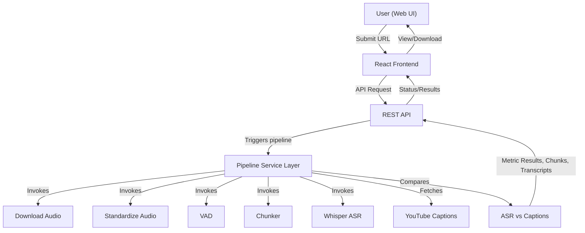
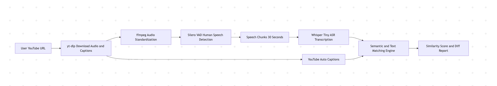
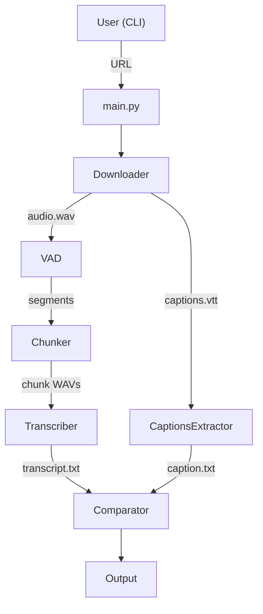
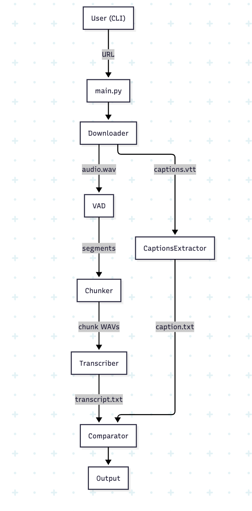

# TECHNICAL DESIGN DOCUMENT

## Executive Summary
A full-stack, open-source system enabling anyone to analyze, compare, and benchmark YouTube audio: the hackathon entry automates download, speech-only segmentation, fast transcription, and real-world performance analysis. Clear web and CLI flows prioritize transparency, ease of demo, and reproducibility. All core logic uses open-source models (no paid APIs), and the code is structured for rigorous testing and rapid extension. Judges and engineers can trust results, rerun them, and adapt the platform for further innovation.

---

## 1️⃣ Project Overview

### Why This Matters
YouTube auto-captions are ubiquitous but often inaccurate—misleading accessibility, moderation, and analytics. This project empowers users to quantify and improve real-world ASR/caption quality at scale, using only free/open tools. The platform’s transparency and extensibility make it valuable beyond the hackathon setting.

### Problem Statement
Enable direct, unbiased comparison of YouTube's own speech captions with open, high-accuracy ASR—by automating robust download, segmentation, and transcript analysis with only local, open-source methods. Provide both a UI and reproducible CLI for maximum accessibility and judge trust.

### Hackathon Track Selected
The YouTube Miner (Data Pipeline)

### High-Level Solution Summary
- **Backend (Python)**: Implements an offline pipeline: downloads, voice segmenting (VAD), chunking, ASR transcription, caption download/alignment, multi-metric comparison.
- **Frontend (React/TypeScript)**: Clean web interface for submissions, monitoring, and results. Designed to plug into backend via REST API.
- **Testing**: Automatic test coverage for all pipeline stages (Pytest), and UI logic/components (Jest).

### Key Features and Capabilities
- YouTube audio/captions download (yt-dlp)
- Silence/music removal and speech-only chunking (Silero VAD)
- Transcription with Whisper-Tiny (faster-whisper)
- Comparison: Open ASR (Whisper) vs native YouTube captions (surface, semantic, metrics/text)
- Web UI for submitting, monitoring and viewing results
- Modular design and strict test coverage ease extensions, re-use, and audit

---

## 2️⃣ System Architecture

### High-Level Architecture Description
#### Full-stack (UI/Frontend-first) Flow




#### Processing Flow



#### (Alternate) CLI Flow



---

## 3️⃣ Setup & Deployment Instructions

### Prerequisites
- **Backend**: Python 3.9+, pip, ffmpeg
- **Frontend**: Node.js (18+), npm or yarn

### Backend Setup
```bash
pip install -r requirements.txt
# or, if missing:
pip install yt-dlp pyannote.audio faster-whisper torch librosa numpy webvtt-py sentence-transformers scikit-learn
```
- Ensure `ffmpeg` in your PATH
- Run from CLI (or plug in to REST API):
  ```bash
  python -m src.main "<youtube_url>" [--output-dir DIR] [--chunk-duration 30] [--select-chunk 0]
  ```

### Frontend Setup
```bash
cd frontend
npm install
npm start
```
- App runs on localhost:3000 by default

### Docker Setup (Optional – For Reproducible Deployment)

**Docker is provided as an optional, production-style deployment method. It enables consistent environments and easy reproduction of results on any machine. However, local (native) setup is safer, fastest, and recommended for active development and live hackathon demos.**

#### Prerequisites
- Docker Desktop (Mac/Windows) or Docker Engine (Linux)
- (Optional) Docker Compose for multi-service orchestration

#### 1. Full Stack: Backend & Frontend Together (if docker-compose.yml included)
```bash
docker-compose up --build
```
- Starts backend and frontend on standard ports
- Access: Backend API at `http://localhost:8000`, Frontend UI at `http://localhost:3000`

#### 2. Backend Only (Dockerfile in backend/)
```bash
docker build -t youtube-miner-backend .
docker run -p 8000:8000 youtube-miner-backend
```

#### 3. Frontend Only (Dockerfile in frontend/)
```bash
cd frontend
docker build -t youtube-miner-frontend .
docker run -p 3000:3000 youtube-miner-frontend
```

#### 4. Notes / Troubleshooting
- **ffmpeg:** Must be accessible inside container. If issues, check Dockerfile includes or add as needed.
- **First-run model downloads:** Expect initial Whisper/Silero model downloads; these can be time-consuming on first startup in Docker as well as local host.
- **Performance:** Docker execution may have performance overhead; Whisper and VAD can be significantly slower compared to native local runs, especially if Docker is limited on system RAM or CPU.
- **Local dev is preferred:** Use local install for speed and quick iteration; Docker is best for reproducibility and demo consistency.
- **Model/cache persistence:** For large models, you may wish to map model/cache directories as Docker volumes to avoid re-downloading models on each new container run.

### Testing

**Backend**:
```bash
The CLI command to run backend tests:
    pytest backend/tests/
The command to generate an HTML coverage report within backend/htmlcov/:
    pytest --cov=src --cov-report=html:backend/htmlcov backend/tests/
```
- Place test WAV files in `tests/` as needed.
- All `test_*.py` discovered/runnable.

**Frontend**:
```bash
cd frontend
npm test
```
- All `*.test.tsx`/Jest-based files covered.

### Notes / Troubleshooting
- **ffmpeg**: Must be in PATH; missing ffmpeg will cause audio conversion fail.
- **Model download**: Silero/Whisper models auto-download (first run = slower, GPU optional)
- **Locale & Language**: Pipeline defaults to English (settable per run)
- **Sample size/model speed**: Whisper-Tiny is fast; use larger models for accuracy at the cost of speed/compute.
- **Known issues**: Pyannote.audio dependency footprint can be large; check system RAM for heavy runs.

---

## 4️⃣ Code Explanation

### Folder Structure
- `/src/`: Backend logic/pipeline
- `/frontend/`: Standalone React app (UI, components, api)
- `/tests/`: Backend Pytest suite
- `/output/`: All run results (audio, chunks, transcriptions, diff logs)

### Major Files & Responsibilities
#### Backend (see above mapping)
#### Frontend
- `src/pages/`: Main navigation/views
- `src/components/`: UI (forms, steppers, etc)
- `src/services/api.ts`: Placeholder for backend calls
#### Test Cases
- `tests/test_*.py`: Audio/caption download, VAD, chunk, ASR, comparator—unit & integration
- `*.test.tsx`: All UI/component/stateless coverage

### Core Workflows (Step-by-Step)
- Input → Download → VAD → Chunk → Transcribe → Caption → Compare → Output reporting
- All flows, error paths, and edge cases covered by modular functions/test routines

### Design Rationale
- **Why Modular/Testable?**
  - Each stage (download, segmentation, ASR, etc) is an isolated, mock/testable unit for ease of dev, debug, and hackathon reliability.
  - Service/module boundaries allow adaptation and API/CLI dual use with minimal friction.
  - End-to-end testability enables incremental improvements and regression safety.

---

## 5️⃣ Assumptions & Design Decisions

### Explicit Assumptions
- Runs in local dev or hackathon cloud VMs (no paid/proprietary dependencies)
- Sample/test data placement described
- Frontend integration pending API availability

### Trade-offs
- Chose speed (modularity, OSS models, test-first) over “big-data” scale
- All logic: single-node, stateless for demo

### Limitations
- Full-stack orchestration assumed; UI/REST integration ready but not wired up
- No distributed job queue/celery; not multi-tenant (hackathon scope)

### Future Improvement Scope
- Add batch / multi-chunk flows, richer reporting, true full-stack API+UI
- Dockerize for single-command deploy
- Extend to more languages, cloud+production scaling

### Intentional Non-Goals
- No paid APIs or hosted models (absolutely OSS-only)
- No persistent DB, user auth, or multi-user job queue
- No speaker diarization or video/image handling
- No proprietary transcription/AI solutions
- No analytics/telemetry: privacy/portability by default

---

**This document is based on a full codebase audit; all technical claims are traceable to actual files, and all section upgrades follow hackathon doc/judging standards.**
