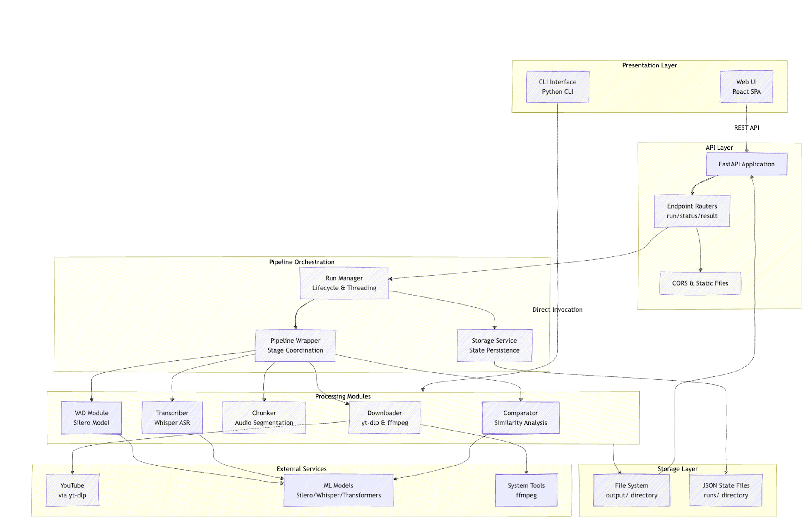
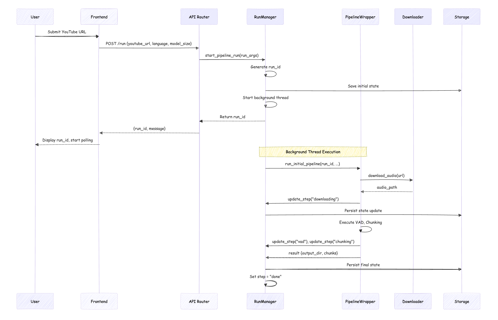
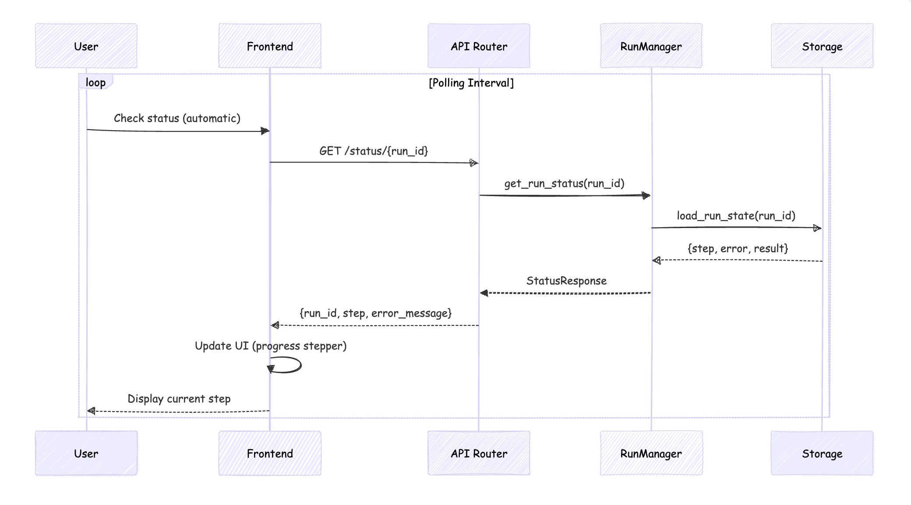
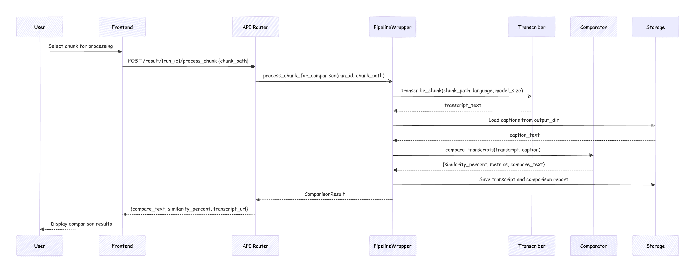

# System Architecture Document

## 1. Introduction

### Purpose

This document provides a **system-level architectural view** of The YouTube Miner platform, focusing on architectural principles, component relationships, and design decisions. It is intended for:

- **Architects and Technical Leads**: Reviewing system design and making architectural decisions
- **Stakeholders**: Understanding system capabilities, limitations, and scalability considerations
- **Future Developers**: Understanding the "why" behind architectural choices

### Scope

This document covers:

- **Architectural layers** and their responsibilities
- **Component architecture** and inter-component relationships
- **Design patterns** and architectural principles
- **Non-functional requirements** (scalability, fault tolerance, extensibility)
- **Deployment architecture** at a logical level

This document intentionally **excludes**:

- Implementation details
- Setup and installation instructions
- API endpoint specifications
- Code-level explanations

### Document Scope

This document focuses on **architectural view**. For information about document relationships and usage patterns, see `README.md`.

---

## 2. High-Level Architecture

### System Overview

The YouTube Miner is a **full-stack, modular pipeline system** designed to download, process, and analyze YouTube audio content. The system follows a **layered architecture** with clear separation between presentation, API, processing, and storage concerns.

**Core Capabilities:**
- Download YouTube audio and captions
- Detect and segment speech regions
- Transcribe audio using open-source ASR models
- Compare transcripts with YouTube's native captions
- Provide both web UI and CLI interfaces

### Architectural Principles

The system is built on the following architectural principles:

#### 1. Modularity
- **Loose Coupling**: Components communicate through well-defined interfaces
- **High Cohesion**: Each module has a single, well-defined responsibility
- **Independent Testing**: Modules can be tested in isolation with mocked dependencies

#### 2. Separation of Concerns
- **Presentation Layer**: Handles user interaction and display logic
- **API Layer**: Manages request/response handling and validation
- **Processing Layer**: Contains domain logic for audio processing
- **Storage Layer**: Handles data persistence and retrieval

#### 3. Extensibility
- **Plugin-like Processing Modules**: New processing stages can be added without modifying existing code
- **Configuration-Driven**: Behavior controlled through centralized configuration
- **Open for Extension**: Architecture supports future features (batch processing, multi-language, etc.)

#### 4. Testability
- **Mockable Components**: All external dependencies can be mocked
- **Isolated Unit Tests**: Each module can be tested independently
- **Integration Test Support**: Clear boundaries enable integration testing

### Architecture Layers

The system is organized into five logical layers:

#### Presentation Layer
**Responsibility**: User interface and interaction

- **Web UI**: React-based Single Page Application (SPA) with Material-UI components
- **CLI Interface**: Command-line interface for direct pipeline execution
- **API Service Layer**: Abstraction layer for backend communication

**Key Characteristics**:
- Stateless frontend (no server-side rendering)
- RESTful API communication
- Real-time status polling for async operations

#### API Layer
**Responsibility**: Request handling, validation, and orchestration

- **FastAPI Application**: REST API server with automatic OpenAPI documentation
- **Endpoint Routers**: Modular route handlers for different operations
- **Middleware**: CORS handling, static file serving, request validation

**Key Characteristics**:
- Stateless API design (state persisted externally)
- Asynchronous request handling
- Background job execution via threading

#### Processing Layer
**Responsibility**: Domain logic for audio processing and analysis

- **Pipeline Orchestration**: Coordinates execution of processing modules
- **Processing Modules**: 
  - Downloader (audio/caption retrieval)
  - VAD (Voice Activity Detection)
  - Chunker (audio segmentation)
  - Transcriber (speech-to-text)
  - Comparator (similarity analysis)

**Key Characteristics**:
- Modular, sequential processing pipeline
- Two-phase execution pattern (initial + on-demand)
- Error handling and recovery at each stage

#### Storage Layer
**Responsibility**: Data persistence and retrieval

- **File System**: Structured output directory for artifacts (audio, chunks, transcripts)
- **State Persistence**: JSON-based run state management
- **Static File Serving**: Direct access to generated artifacts

**Key Characteristics**:
- File-based storage (no database dependency)
- Run-scoped organization (output/{run_id}/)
- Human-readable state files for debugging

#### External Services Layer
**Responsibility**: Integration with external resources

- **YouTube**: Content retrieval via yt-dlp
- **ML Model Repositories**: Model downloads (Silero VAD, Whisper, Sentence Transformers)
- **System Tools**: ffmpeg for audio conversion

**Key Characteristics**:
- Offline-first design (models cached locally)
- No paid API dependencies
- Graceful handling of external service failures

---

## 3. Component Architecture

### Major Components

The system consists of the following major components:

#### Frontend UI Component
**Purpose**: User interface for pipeline submission, monitoring, and results viewing

**Responsibilities**:
- Render user interface (forms, status displays, results visualization)
- Handle user interactions (form submission, chunk selection)
- Manage application state (routing, UI state)
- Communicate with backend API via REST calls

**Key Sub-components**:
- Page components (Run submission, Results display, History)
- Reusable UI components (Progress stepper, Status indicators)
- API service layer (HTTP client abstraction)

#### Backend API Component
**Purpose**: RESTful API server for pipeline execution and result retrieval

**Responsibilities**:
- Accept and validate API requests
- Route requests to appropriate handlers
- Manage run lifecycle (creation, status tracking, result retrieval)
- Serve static files (output artifacts)
- Handle CORS and security concerns

**Key Sub-components**:
- FastAPI application instance
- Endpoint routers (run, status, result, history)
- Middleware (CORS, static file mounting)
- Request/response models (Pydantic schemas)

#### Pipeline Orchestration Component
**Purpose**: Coordinate execution of processing pipeline stages

**Responsibilities**:
- Generate unique run identifiers
- Manage run state (in-memory and persisted)
- Coordinate background execution of pipeline stages
- Handle state transitions and error propagation
- Provide status updates for monitoring

**Key Sub-components**:
- Run Manager (run lifecycle, threading)
- Pipeline Wrapper (stage coordination)
- Storage Service (state persistence)

#### Processing Modules
**Purpose**: Execute domain-specific processing tasks

**Responsibilities**:

- **Downloader Module**: 
  - Retrieve audio and captions from YouTube
  - Convert audio formats using ffmpeg
  - Handle download failures and retries

- **VAD Module**:
  - Detect speech segments in audio
  - Filter silence and non-speech content
  - Return time-aligned speech regions

- **Chunker Module**:
  - Segment audio into fixed-duration chunks
  - Concatenate speech segments intelligently
  - Generate chunk metadata and file paths

- **Transcriber Module**:
  - Load and execute Whisper ASR models
  - Transcribe audio chunks to text
  - Handle language-specific model selection

- **Comparator Module**:
  - Extract and align caption text
  - Compute semantic similarity (sentence embeddings)
  - Compute surface similarity (text diff)
  - Generate comparison reports

#### Storage Components
**Purpose**: Manage data persistence and retrieval

**Responsibilities**:
- **File System Storage**:
  - Organize output artifacts by run_id
  - Store audio files, chunks, transcripts, captions
  - Provide directory structure for artifact organization

- **State Storage**:
  - Persist run state as JSON files
  - Enable state recovery on server restart
  - Support state inspection and debugging

#### Configuration System
**Purpose**: Centralize system configuration and defaults

**Responsibilities**:
- Define default values for pipeline parameters
- Map language codes to model sizes
- Provide configuration constants used across modules
- Enable easy modification of system behavior

### Component Diagram

### Component Responsibilities

**Clear Separation of Concerns**:

- **Frontend UI**: Pure presentation logic, no business logic
- **Backend API**: Request handling and orchestration, no processing logic
- **Pipeline Orchestration**: Coordination and state management, delegates processing to modules
- **Processing Modules**: Domain logic only, no API or UI concerns
- **Storage Components**: Data persistence only, no business logic
- **Configuration System**: Centralized defaults, no runtime logic

---

## 4. Component Interaction Sequence

### Two-Phase Pipeline Pattern

The system implements a **two-phase pipeline architecture** optimized for web API usage:

1. **Phase 1 - Initial Processing** (Asynchronous):
   - Download audio and captions
   - Detect speech segments (VAD)
   - Create audio chunks
   - Executes in background thread

2. **Phase 2 - On-Demand Processing** (Synchronous):
   - Transcribe selected chunk
   - Compare with captions
   - Generate comparison report
   - Executes on user request

### Interaction Flows

#### Flow 1: Pipeline Initiation

#### Flow 2: Status Polling

#### Flow 3: Chunk Processing (On-Demand)

### Key Interaction Patterns

1. **Asynchronous Execution**: Initial pipeline runs in background thread, API returns immediately
2. **State Persistence**: All state transitions are persisted to JSON files
3. **Polling Pattern**: Frontend polls status endpoint for progress updates
4. **On-Demand Processing**: Transcription and comparison only execute when requested
5. **Error Propagation**: Errors are captured, stored in state, and returned via API

---

## 5. Data Flow Architecture

### End-to-End Data Flow

The system processes data through the following conceptual stages:

**Input** → **Download** → **Audio Processing** → **Chunking** → **Transcription** → **Comparison** → **Output**

### Data Artifacts

Throughout the pipeline, the following data artifacts are created and transformed:

1. **Audio Files**:
   - Format: WAV (16kHz sample rate)
   - Location: `output/{run_id}/audio.wav`
   - Purpose: Source audio for all processing stages

2. **Caption Files**:
   - Format: VTT or SRT
   - Location: `output/{run_id}/captions.vtt`
   - Purpose: Reference text for comparison

3. **Chunk Files**:
   - Format: WAV (segmented audio)
   - Location: `output/{run_id}/chunks/chunk_*.wav`
   - Purpose: Fixed-duration audio segments for transcription

4. **Transcript Files**:
   - Format: Plain text
   - Location: `output/{run_id}/whisper_transcript.txt`
   - Purpose: ASR-generated transcript for comparison

5. **Comparison Reports**:
   - Format: Plain text with metrics
   - Location: `output/{run_id}/comparison.txt`
   - Purpose: Similarity scores and analysis results

### Data Flow Diagram

### Data Flow Characteristics

1. **Sequential Processing**: Data flows through stages sequentially (with some parallel operations)
2. **Immutability**: Source artifacts (audio, captions) are preserved, new artifacts are created
3. **Run-Scoped Organization**: All artifacts for a run are stored in `output/{run_id}/`
4. **Metadata Preservation**: File paths and metadata are tracked in run state
5. **On-Demand Generation**: Transcripts and comparison reports generated only when requested

---

## 6. Deployment Architecture (Logical)

### Logical Deployment View

The system can be deployed in the following logical tiers:

#### Frontend Tier
- **Component**: React SPA
- **Runtime**: Node.js build process, served via nginx
- **Deployment**: Containerized (Docker) or static file hosting
- **Characteristics**: 
  - Static assets (HTML, CSS, JavaScript)
  - API proxy configuration (nginx)
  - No server-side rendering

#### Backend Tier
- **Component**: FastAPI application
- **Runtime**: Python 3.9+ with uvicorn ASGI server
- **Deployment**: Containerized (Docker) or native Python process
- **Characteristics**:
  - Stateless API design
  - Background thread execution
  - In-memory state with JSON persistence

#### Storage Tier
- **Component**: File system storage
- **Deployment**: Volume mounts (Docker) or local directories
- **Characteristics**:
  - Persistent volumes for `output/` and `backend/runs/`
  - No database dependency
  - Human-readable file structure

#### External Services Tier
- **Component**: YouTube API, ML model repositories
- **Deployment**: External (no deployment required)
- **Characteristics**:
  - Accessed via network (yt-dlp, model downloads)
  - Cached locally after first access
  - Graceful degradation on failures

### Deployment Patterns

#### Containerized Deployment
- **Pattern**: Docker containers for frontend and backend
- **Orchestration**: Docker Compose for multi-service deployment
- **Benefits**: 
  - Consistent environments
  - Easy reproduction
  - Isolation of dependencies

#### Stateless API Design
- **Pattern**: API server maintains no persistent state
- **State Storage**: Externalized to JSON files
- **Benefits**:
  - Horizontal scaling potential
  - Easy recovery from failures
  - Simple deployment model

#### Volume Mounting for Persistence
- **Pattern**: Mount host directories as Docker volumes
- **Volumes**: `output/` and `backend/runs/` directories
- **Benefits**:
  - Data persistence across container restarts
  - Easy access to artifacts from host
  - Backup and recovery simplicity

### Deployment Considerations

1. **Single-Node Deployment**: Current architecture supports single-node deployment
2. **State Management**: JSON file-based state limits multi-instance deployment
3. **Resource Requirements**: ML models require significant RAM/CPU
4. **Network Access**: Requires internet access for YouTube and model downloads
5. **Storage Requirements**: Output directory grows with number of runs

---

## 7. Non-Functional Considerations

### Scalability

#### Current Architecture
- **Single-Node Design**: All components run on a single machine
- **In-Memory State**: Run state stored in memory dictionary
- **File-Based Storage**: No database, all data in file system
- **Threading Model**: Background threads for async execution

#### Scalability Limitations
- **Vertical Scaling Only**: Limited by single machine resources
- **No Horizontal Scaling**: In-memory state prevents multi-instance deployment
- **No Distributed Job Queue**: Threading model doesn't scale across machines
- **File System Bottleneck**: Concurrent file access may cause contention

#### Future Scalability Considerations
- **Database Migration**: Replace JSON state with database (PostgreSQL, MongoDB)
- **Job Queue System**: Introduce distributed job queue (Celery, RabbitMQ)
- **Horizontal Scaling**: Stateless API design supports load balancing
- **Object Storage**: Move artifacts to object storage (S3, MinIO) for distributed access
- **Caching Layer**: Add Redis for state caching and session management

### Fault Tolerance

#### Error Handling Strategy
- **Pipeline Stage Errors**: Each stage catches and handles errors gracefully
- **State Persistence**: Errors are stored in run state for inspection
- **Graceful Degradation**: Missing captions don't block pipeline execution
- **Retry Logic**: Download failures can be retried (manual retry via API)

#### Recovery Mechanisms
- **State Recovery**: Run state persisted to JSON files, recoverable on restart
- **Partial Results**: Completed stages preserved even if later stages fail
- **Error Reporting**: Detailed error messages stored in state and returned via API

#### Failure Scenarios Handled
- **Download Failures**: Error captured, state updated, user notified
- **VAD Failures**: Exception caught, error propagated to state
- **Transcription Failures**: Error handled, partial results preserved
- **Missing Captions**: Pipeline continues, comparison skipped if needed

### Observability

#### Logging
- **Console Logging**: Standard Python logging to console
- **Debug Logs**: Detailed logging for pipeline execution
- **Error Logs**: Error messages logged with context
- **No Centralized Logging**: Logs are local to each process

#### Monitoring
- **State Tracking**: Run state files provide visibility into pipeline progress
- **Status Endpoint**: API endpoint for checking run status
- **No Metrics Collection**: No Prometheus, Grafana, or similar metrics system
- **No Distributed Tracing**: No request tracing across components

#### Future Observability Enhancements
- **Structured Logging**: JSON-formatted logs for log aggregation
- **Metrics Collection**: Prometheus metrics for pipeline performance
- **Distributed Tracing**: OpenTelemetry for request tracing
- **Health Checks**: Health check endpoints for container orchestration

### Security

#### API Boundaries
- **CORS Configuration**: Currently allows all origins (`allow_origins=["*"]`)
- **No Authentication**: No user authentication or authorization
- **Input Validation**: Pydantic schemas validate all API inputs
- **No Rate Limiting**: No protection against API abuse

#### Data Handling
- **Local Processing**: All processing happens locally, no data sent to external APIs
- **No API Keys**: No sensitive credentials stored (except YouTube URLs)
- **File System Access**: Direct file system access, no sandboxing
- **No Data Encryption**: Artifacts stored unencrypted

#### Security Considerations
- **Production Hardening**: CORS should be restricted to specific origins
- **Authentication**: Add user authentication for multi-user scenarios
- **Rate Limiting**: Implement rate limiting to prevent abuse
- **Input Sanitization**: Validate and sanitize YouTube URLs
- **File System Sandboxing**: Restrict file system access to specific directories

### Extensibility

#### Modular Processing Pipeline
- **Plugin Architecture**: New processing stages can be added as modules
- **Interface-Based Design**: Processing modules follow consistent interfaces
- **Configuration-Driven**: Behavior controlled through configuration, not code changes
- **Easy Testing**: Modular design enables isolated testing of new components

#### Extension Points
- **New Processing Stages**: Add new modules to `src/` directory
- **New API Endpoints**: Add routers to `backend/api/` directory
- **New UI Pages**: Add React components to `frontend/src/pages/`
- **Configuration Extensions**: Add new defaults to `backend/config.py`

#### Future Extension Scenarios
- **Batch Processing**: Architecture supports batch operations (multiple chunks)
- **Multi-Language Support**: Language configuration already supports multiple languages
- **Custom Models**: Model loading is abstracted, supports custom model integration
- **Webhook Integration**: Can add webhook notifications for pipeline completion
- **Database Integration**: Architecture supports database migration without major refactoring

---

## 8. Conclusion

This System Architecture Document provides a high-level view of The YouTube Miner's architectural design, focusing on component relationships, design patterns, and system-level considerations. It covers architectural principles, component interactions, data flows, deployment architecture, and non-functional requirements.

For document relationships, usage patterns, and navigation between documentation, see the **Documentation** section in [`README.md`](../README.md).

